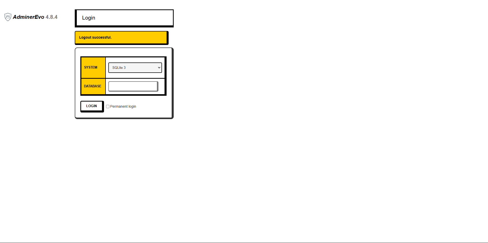
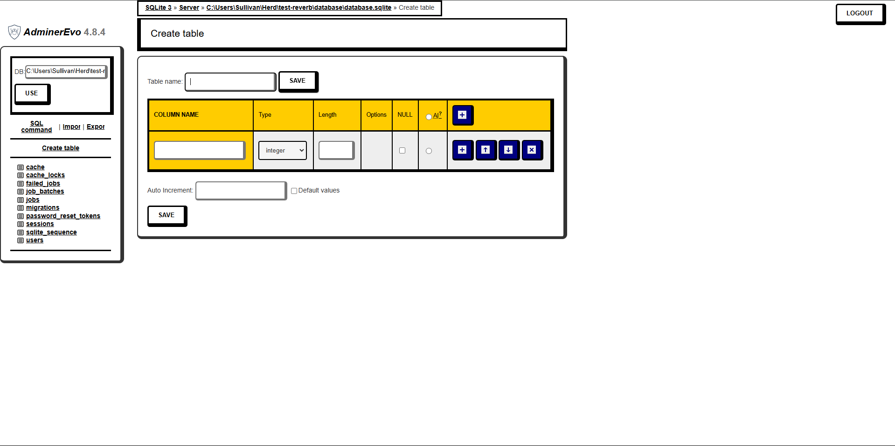
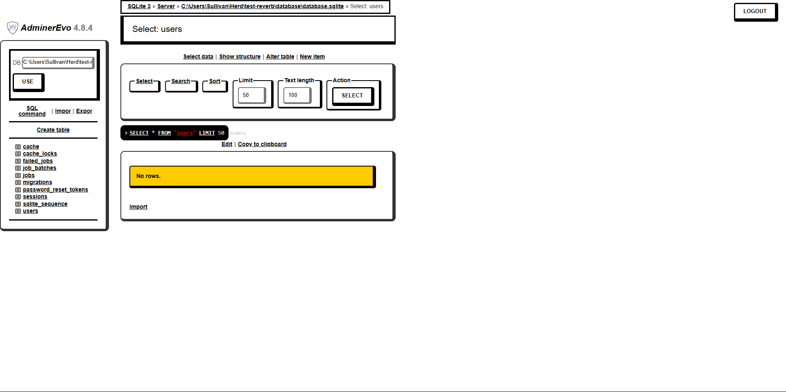
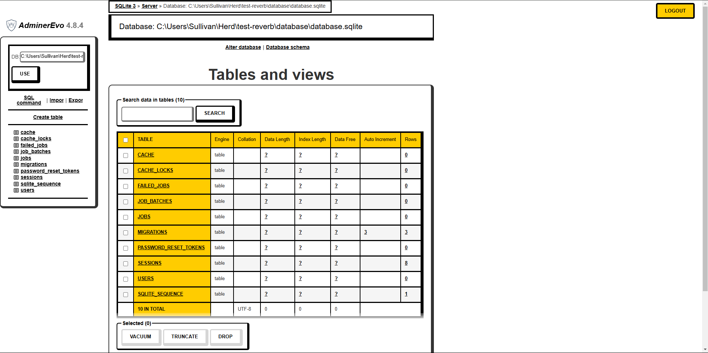

# AdminerEvo with NeoBrutalism Theme

AdminerEvo is a web-based database management interface, with a focus on security, user experience, performance, functionality and size.

It is available for download as a single self-contained PHP file, making it easy to deploy anywhere.


## Features

- Easy to connect with SQLite
- Fresh theme
- Plugin initialized
- Easy to install


## Screenshots







## Run Locally

Ensure you are in the directory where you want to store the project files. For example, in `htdocs` if using XAMPP:


```bash
  cd htdocs
```

Clone the Repository:

```bash
  git clone https://github.com/RizkiIqbal02/adminer
```

Once the repository is cloned, you can access the application in your browser at: [http://localhost/adminer](http://localhost/adminer)

## License

[MIT](https://choosealicense.com/licenses/mit/)


## Authors

- [@RizkiIqbal02](https://github.com/RizkiIqbal02)

